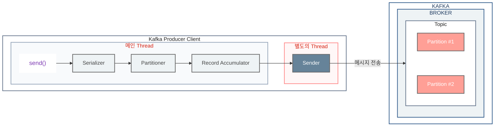
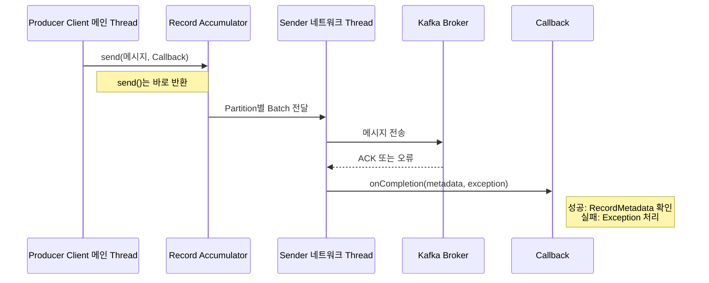

## 개요

Kafka Producer의 `send()`는 호출한 스레드가 Broker까지 직접 전송하는 방식이 아니다.

메인 스레드는 메시지를 직렬화하고 전송할 Partition을 결정한 뒤 `Record Accumulator`에 저장한다. 이후 실제 네트워크 전송은 Producer Client 내부의 `Sender` 스레드가 맡는다.



## Producer Client의 두 스레드

### 메인 Thread

애플리케이션 코드에서 `send()`를 호출하면 메인 Thread가 다음 작업을 수행한다.

1. `Serializer`가 메시지를 `byte[]`로 직렬화한다.
2. `Partitioner`가 메시지를 보낼 Partition을 결정한다.
3. 메시지를 `Record Accumulator`의 Partition별 Batch에 저장한다.

여기까지는 `send()`를 호출한 메인 Thread의 작업이다. 메인 Thread는 Broker의 응답을 기다리지 않고 다음 코드를 실행할 수 있다.

### 별도의 Sender Thread

`Sender`는 `kafka-producer-network-thread`라는 별도 스레드에서 실행된다.

이 스레드는 `Record Accumulator`에서 Partition별 Batch를 읽어 Broker에 전송하고, Broker의 응답을 처리한다. 그래서 애플리케이션의 메인 Thread가 네트워크 응답을 기다리지 않아도 된다.


디버거의 Thread 목록에서도 `kafka-producer-network-thread | producer-1`이 실행 중인 것을 확인할 수 있다.

## 동기 전송과 비동기 전송

`KafkaProducer.send()`는 기본적으로 비동기 호출이다. `send()`를 호출하면 즉시 `Future<RecordMetadata>`를 받고, 실제 전송 결과는 나중에 받을 수 있다.

동기 전송은 전송 결과를 받은 뒤에 다음 코드를 실행하므로, 호출한 코드의 흐름을 한 줄씩 따라가기 쉽다. 반대로 네트워크 응답이 늦어지면 그만큼 현재 작업도 멈춘다.

비동기 전송은 결과를 기다리는 시간을 다음 작업에 사용할 수 있어 많은 메시지를 보낼 때 유리하다. 대신 성공·실패 후에 해야 할 일은 `send()` 호출부가 아니라 Callback 안에 작성해야 하므로, 전송 결과와 이어지는 로직의 위치가 나뉜다.

다만 동기 호출 자체가 Kafka 메시지의 순서를 보장하는 것은 아니다. Kafka의 메시지 순서는 같은 Partition 안에서 보장되며, 순서가 필요한 메시지는 같은 Key를 사용해 같은 Partition으로 보내야 한다.

### 비동기 전송

비동기 전송은 Broker의 응답을 기다리지 않고 다음 작업을 계속한다.

```java
Future<RecordMetadata> future = producer.send(producerRecord);

// 다른 작업을 계속 수행할 수 있다.
```

처리량이 중요한 경우에 적합하다. 다만 전송 성공·실패 결과를 확인하려면 `Callback`을 함께 사용해야 한다.

### 동기 전송

`Future.get()`을 호출하면 Broker의 응답이 올 때까지 현재 Thread가 기다린다. 이때 비동기 `send()` 호출을 동기처럼 사용할 수 있다.

```java
Future<RecordMetadata> future = producer.send(producerRecord);
RecordMetadata metadata = future.get();
```

한 줄로도 작성할 수 있다.

```java
RecordMetadata metadata = producer.send(producerRecord).get();
```

동기 전송은 성공한 메시지의 Topic, Partition, Offset을 바로 확인하기 쉽다. 하지만 응답을 기다리는 동안 메인 Thread가 멈추므로, 많은 메시지를 빠르게 보내야 하는 상황에서는 처리량이 낮아질 수 있다.

### Future란?

`Future`는 아직 끝나지 않은 비동기 작업의 결과를 담는 객체다.

`send()` 직후에는 실제 전송 결과가 없을 수 있다. 이후 `get()`을 호출하면 작업이 끝날 때까지 기다렸다가 `RecordMetadata`를 반환한다.

## Callback으로 전송 결과 처리하기

`Callback`은 어떤 작업이 끝났을 때 실행할 코드를 미리 전달하는 방식이다.

Kafka Producer에서는 `send()` 호출 시 Callback을 함께 전달한다. Sender Thread가 Broker 응답을 받으면 성공 시 `RecordMetadata`, 실패 시 `Exception`과 함께 `onCompletion()`을 호출한다.



Callback 자체는 단순히 “나중에 실행할 코드”다.

1. Callback이 실행할 메서드인 `onCompletion()`을 작성한다.
2. `send()`의 두 번째 인자로 Callback을 전달한다.
3. Sender Thread가 전송 결과를 받으면 `onCompletion()`을 호출한다.

Callback 안에서는 오래 걸리는 작업을 피하는 것이 좋다. Callback은 Sender 네트워크 Thread에서 실행되므로, 무거운 로직을 넣으면 다음 메시지 전송도 늦어질 수 있다.

```java
producer.send(producerRecord, new Callback() {
    @Override
    public void onCompletion(RecordMetadata metadata, Exception exception) {
        if (exception == null) {
            System.out.println("received metadata\n" +
                    "Topic: " + metadata.topic() + "\n" +
                    "Partition: " + metadata.partition() + "\n" +
                    "Offset: " + metadata.offset());
            return;
        }

        exception.printStackTrace();
    }
});
```

성공하면 `RecordMetadata`에서 메시지가 저장된 Topic, Partition, Offset을 확인할 수 있다. 실패하면 `exception`을 확인해 재시도, 로그 기록, 알림 같은 처리를 할 수 있다.

## 정리

- 메인 Thread는 `send()` 호출, 직렬화, Partition 결정, `Record Accumulator` 저장을 담당한다.
- 별도의 `Sender` 네트워크 Thread가 `Record Accumulator`의 Batch를 Broker로 전송한다.
- `send()`는 기본적으로 비동기이며 `Future.get()`을 호출하면 동기 방식으로 기다릴 수 있다.
- 비동기 전송 결과는 `Callback`의 `onCompletion()`에서 성공 메타데이터 또는 예외로 처리한다.
