## 개요

Kafka Producer의 `acks` 설정은 Producer가 메시지를 보낸 뒤 어느 시점에 전송 성공으로 판단할지를 결정한다.

`acks` 값을 이해하려면 먼저 Leader Replica와 Follower Replica의 역할을 알아야 한다. Producer는 Topic의 아무 Broker에 메시지를 보내는 것이 아니라, 대상 Partition의 Leader Replica가 있는 Broker에 메시지를 전송한다. Leader는 메시지를 기록한 뒤 Follower Replica가 이를 복제하도록 한다.

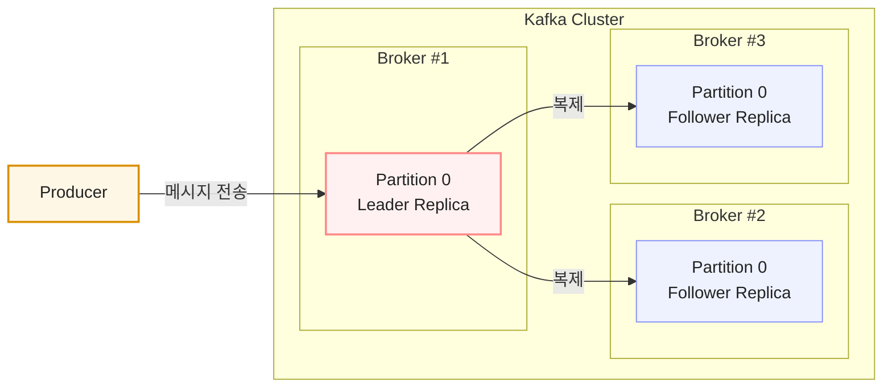

Replication Factor가 `3`이면 동일한 Partition의 Replica가 Leader 1개와 Follower 2개, 총 3개 존재한다. Producer의 메시지는 Leader에 먼저 기록되고, Follower는 Leader의 데이터를 복제한다.

## Replica, Leader, Follower

Replica는 Partition 데이터의 복제본 하나를 뜻한다. 따라서 Leader와 Follower는 모두 Replica이며, 현재 맡고 있는 역할만 다르다.


| 구분               | 의미                                             |
| ---------------- | ---------------------------------------------- |
| Replica          | Partition 데이터의 복제본 하나                          |
| Leader Replica   | Producer의 쓰기와 Consumer의 읽기를 직접 처리하는 기준 Replica |
| Follower Replica | Leader Replica의 데이터를 복제하는 Replica              |


예를 들어 Replication Factor가 `3`이면 Replica는 총 3개다. 이 중 하나가 Leader Replica가 되고, 나머지 두 개는 Follower Replica가 된다. Leader에 장애가 발생하면 Kafka는 동기화된 Follower Replica 중 하나를 새 Leader로 선출할 수 있다.

## acks 설정

`acks`에는 `0`, `1`, `all(-1)` 값을 설정할 수 있다. 값에 따라 Producer가 Broker의 응답을 기다리는 범위와 메시지 유실 가능성이 달라진다.

이 글에서 설명하는 설정의 기본값은 Kafka 4.3 공식 문서를 기준으로 한다.

```java
Properties props = new Properties();

props.setProperty(ProducerConfig.BOOTSTRAP_SERVERS_CONFIG, "localhost:9092");
props.setProperty(ProducerConfig.KEY_SERIALIZER_CLASS_CONFIG, StringSerializer.class.getName());
props.setProperty(ProducerConfig.VALUE_SERIALIZER_CLASS_CONFIG, StringSerializer.class.getName());
// acks 설정
props.setProperty(ProducerConfig.ACKS_CONFIG, "0"); // 0, 1, all(-1)

KafkaProducer<String, String> producer = new KafkaProducer<>(props);
```

`bootstrap.servers`, `key.serializer`, `value.serializer`는 기본값이 없으므로 Producer를 생성할 때 직접 지정해야 한다.

`acks=0`에서 `send(...).get()`을 호출해도 Broker 응답을 받지 않으므로, 성공한 레코드의 실제 Offset을 확인할 수 없다. 이 경우 `RecordMetadata`의 Offset은 `-1`처럼 유효하지 않은 값으로 보일 수 있다.


| 설정         | 기본 설정 여부 | Producer가 기다리는 응답          | 특징                                          |
| ---------- | -------- | -------------------------- | ------------------------------------------- |
| `acks=0`   |          | 응답을 기다리지 않음                | 가장 빠르지만 전송 실패를 확인할 수 없음                     |
| `acks=1`   |          | Leader Replica의 기록 완료      | Leader 장애 시 Follower에 복제되지 않은 메시지가 유실될 수 있음 |
| `acks=all` | O        | 필요한 In-Sync Replica의 기록 완료 | 가장 높은 내구성을 제공하지만 응답을 더 기다릴 수 있음             |


### acks=0

`acks=0`에서는 Producer가 Broker의 응답을 기다리지 않고 다음 메시지를 전송한다. 따라서 Producer는 해당 메시지가 Leader에 정상적으로 기록되었는지 확인할 수 없다.

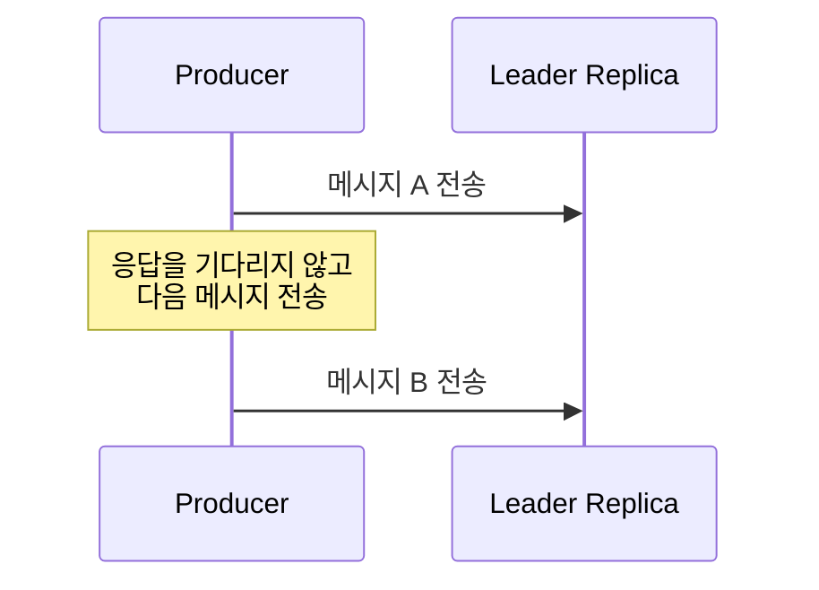

응답을 받지 않으므로 네트워크 오류나 Broker 장애로 전송에 실패해도 Producer가 실패를 인지할 수 없다. 메시지 유실을 허용할 수 있고 전송 속도가 특히 중요한 경우에만 신중하게 사용할 수 있다.

### acks=1

`acks=1`에서는 Leader Replica가 메시지를 기록한 뒤 Producer에 응답한다. Follower Replica의 복제 완료까지는 기다리지 않는다.

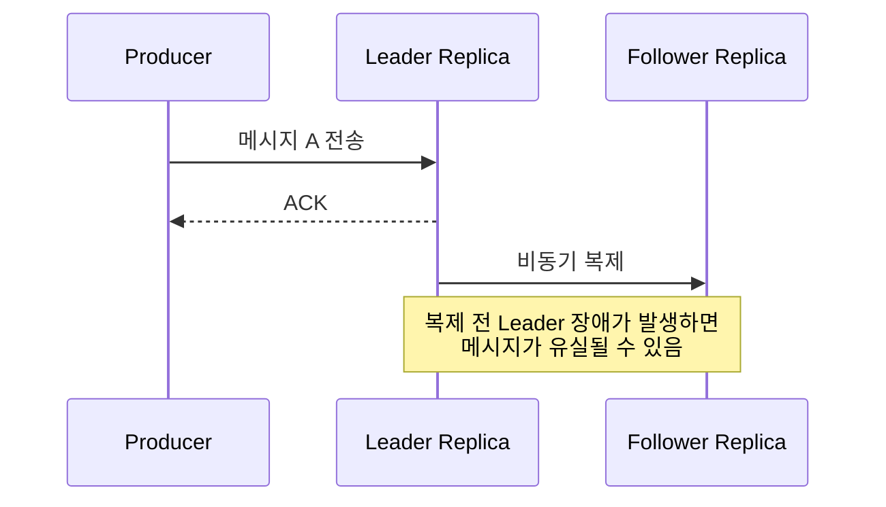

Leader까지 기록된 사실은 확인할 수 있으므로 `acks=0`보다 안전하다. 다만 Leader가 응답한 직후 Follower에 복제되기 전에 장애가 발생하면, 새 Leader에는 해당 메시지가 없을 수 있다.

### acks=all

`acks=all`은 Leader가 메시지를 기록하고, 현재 동기화 상태인 Replica(In-Sync Replica, ISR) 중 필요한 Replica에도 기록된 뒤 Producer에 응답하는 방식이다. 최근 Kafka Producer의 기본값은 `all`이다.

ISR은 Leader의 최신 메시지를 충분히 따라잡아 동기화된 Replica의 목록이다. Leader Replica도 ISR에 포함되며, 복제가 많이 지연되거나 Broker에 장애가 난 Follower Replica는 ISR에서 제외될 수 있다.

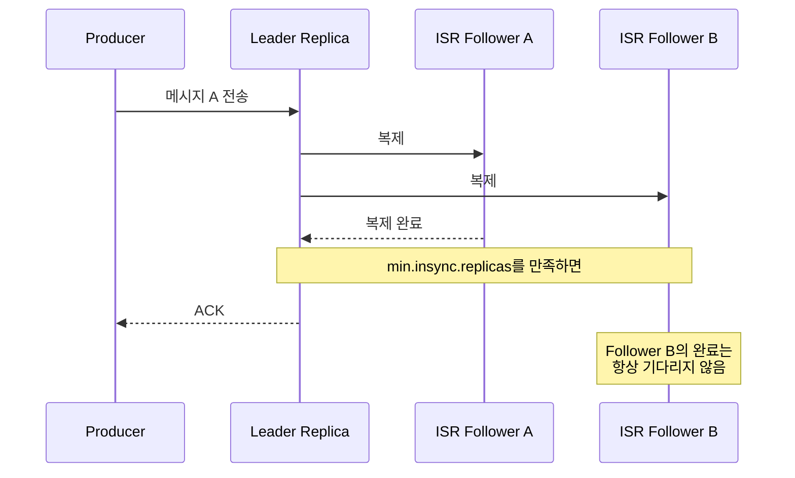

`acks=all`이라고 해서 항상 모든 Follower Replica의 복제 완료를 기다리는 것은 아니다. 실제로 필요한 ISR 수는 Topic 또는 Broker 설정의 `min.insync.replicas`와 함께 결정된다.

## min.insync.replicas

`min.insync.replicas`는 `acks=all`일 때 메시지를 성공으로 처리하기 위해 필요한 최소 ISR 수다. 이 수에는 Leader Replica도 포함된다. 즉, ISR은 현재 동기화되어 쓰기에 참여할 수 있는 Replica 집합이고, `min.insync.replicas`는 그중 최소 몇 개가 메시지를 기록해야 하는지를 정하는 값이다. 기본값은 `1`이다.

예를 들어 Replication Factor가 `3`이고 `min.insync.replicas=2`라면, Leader를 포함해 최소 2개의 ISR에 메시지가 기록되어야 ACK를 받을 수 있다.

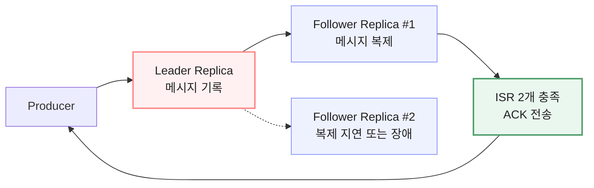

반대로 `acks=all`에서 ISR 수가 `min.insync.replicas`보다 적으면 Broker는 쓰기를 거절하고 `NOT_ENOUGH_REPLICAS` 오류를 반환할 수 있다. Java Producer에서는 이 오류가 `NotEnoughReplicasException`으로 전달될 수 있다.

메시지가 Leader에 기록된 뒤 필요한 ISR 수를 만족하지 못한 경우에는 `NOT_ENOUGH_REPLICAS_AFTER_APPEND` 오류가 발생할 수도 있다. Producer는 전송 실패를 처리할 때 두 오류를 구분하더라도, 애플리케이션에서는 재시도와 중복 처리 가능성을 함께 고려해야 한다.

## Producer의 메시지 배치 전송

`KafkaProducer.send()`는 호출 즉시 Broker로 메시지를 한 건씩 보내지 않는다. 호출한 Thread는 메시지를 준비해 `Record Accumulator`에 넣고, 별도의 `Sender` Thread가 Partition별 `Record Batch`를 꺼내 Broker로 전송한다.

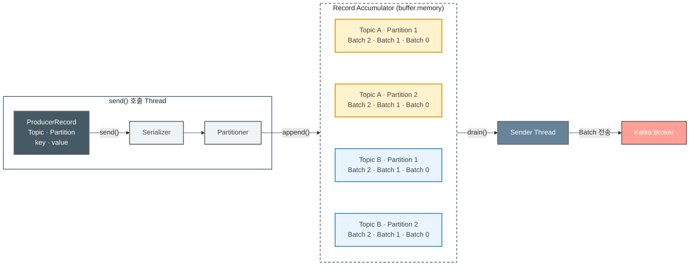

### Record Accumulator와 Batch

`Record Accumulator`는 Producer Client 내부 메모리에서 전송 대기 중인 레코드를 Partition별로 모아 두는 공간이다. 같은 Partition으로 향하는 레코드가 하나의 `Record Batch`에 묶인다. `buffer.memory`는 `Record Accumulator`의 전체 메모리 사이즈이며, 기본값은 `33,554,432 byte(32 MiB)`다.

따라서 메시지 순서는 Partition별로 관리된다. 서로 다른 Partition의 레코드는 서로 다른 Batch에 들어가며, Sender는 준비된 여러 Batch를 한 요청에 함께 실어 보낼 수 있다.

### batch.size와 linger.ms

`batch.size`는 Partition별 `Record Batch`가 목표로 하는 최대 크기다. 기본값은 `16,384 byte(16 KiB)`다. Batch가 `batch.size`까지 차면 Sender가 전송 후보로 만들 수 있다. 다만 이 값은 “항상 이 크기만큼 모아서 전송한다”는 뜻이 아니다. 전송할 준비가 된 Batch는 덜 찬 상태에서도 전송될 수 있다.

`linger.ms`는 Sender가 즉시 전송하지 않고, 더 많은 레코드를 같은 Batch에 모으기 위해 기다릴 수 있는 최대 시간이다. Kafka 4.3 기준 기본값은 `5ms`다. 이 시간 안에 Batch가 충분히 차면 더 빨리 전송할 수 있다.

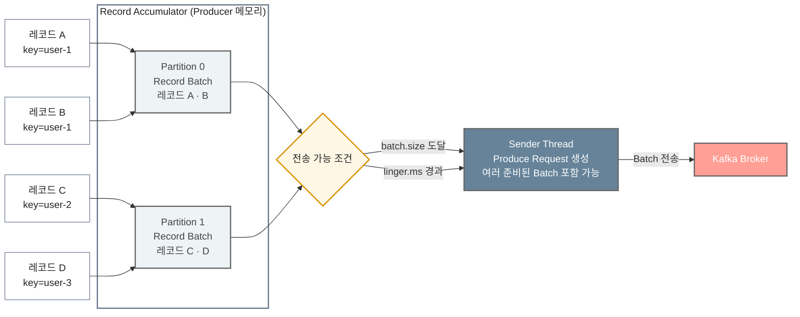

`linger.ms`를 반드시 0보다 크게 설정할 필요는 없다. 이미 충분한 트래픽이 있어 Batch가 빠르게 채워진다면 0이어도 Batch 전송이 일어날 수 있다. 반대로 레코드 유입이 적어 작은 Batch가 자주 전송된다면 `linger.ms`를 늘려 처리량을 높일 여지가 있지만, 그만큼 전송 지연도 늘어난다. 값은 고정된 권장치보다 처리량·지연 시간 요구와 실제 측정 결과를 기준으로 정한다.

## 전송 실패와 재시도

전송 중 일시적인 네트워크 문제나 Leader 교체가 발생하면 Producer는 재시도할 수 있다. 이때 `retries`는 재시도 횟수의 상한을, `delivery.timeout.ms`는 레코드가 전송·재시도를 포함해 성공 또는 실패로 끝나기까지 허용하는 전체 시간을 정한다. `retries`의 기본값은 `2,147,483,647`이고, 실제 재시도 종료 시점은 기본 `120,000ms(2분)`인 `delivery.timeout.ms`의 영향을 함께 받는다.

최근 Producer 설정에서는 `retries`보다 `delivery.timeout.ms`를 중심으로 재시도 종료 시점을 조정하는 편이 이해하기 쉽다. 재시도 가능 오류가 발생해도 전체 제한 시간에 도달하면 해당 레코드는 실패 처리된다.


| 설정                    | 기본값             | 의미                                                                                                                                     |
| --------------------- | --------------- | -------------------------------------------------------------------------------------------------------------------------------------- |
| `retries`             | `2,147,483,647` | 재시도 횟수의 상한이다. 실제 재시도 가능 시간은 `delivery.timeout.ms`의 제한도 함께 받는다.                                                                         |
| `max.block.ms`        | `60,000ms`      | `send()` 호출 시 레코드를 `Record Accumulator`에 추가하지 못해 호출한 Thread가 대기할 수 있는 최대 시간이다. 초과하면 `TimeoutException`이 발생한다.                          |
| `request.timeout.ms`  | `30,000ms`      | 메시지를 전송한 뒤 Broker의 응답을 기다리는 최대 시간이다. `retry.backoff.ms` 대기 시간은 포함하지 않는다. 초과하면 재시도하거나 `TimeoutException`으로 실패할 수 있다.                    |
| `retry.backoff.ms`    | `100ms`         | 전송 실패 후 다음 재시도를 시작하기 전에 기다리는 시간이다.                                                                                                     |
| `delivery.timeout.ms` | `120,000ms`     | Producer가 메시지 또는 Batch의 전송 결과를 성공이나 실패로 확정하기까지 허용하는 전체 시간이다. Batch 대기, Broker 요청, 재시도 대기와 재전송 시간을 포함하며, 초과하면 `TimeoutException`이 발생한다. |


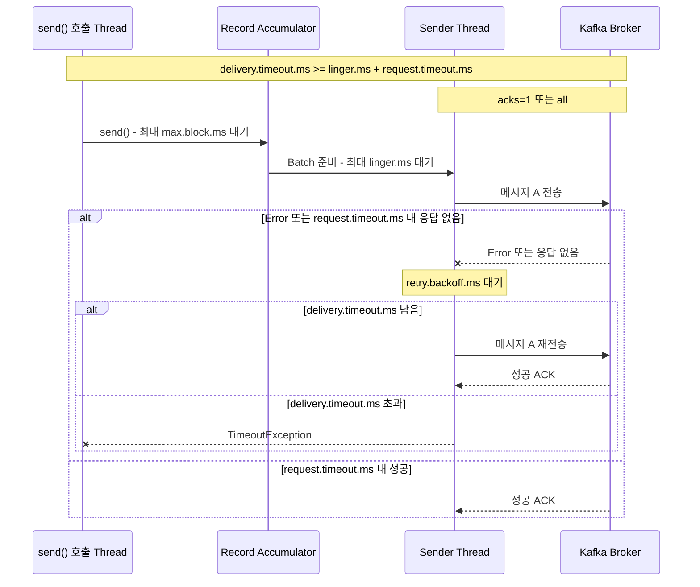

재시도는 중복 가능성도 함께 고려해야 한다. Broker가 메시지를 기록했지만 Producer가 응답을 받지 못한 경우, Producer는 실패로 판단하고 같은 레코드를 다시 보낼 수 있다. 중복을 줄이고 재시도 중 순서 문제를 다루려면 멱등성 Producer 설정과 소비 측 중복 처리 전략을 함께 검토해야 한다.

## max.in.flight.requests.per.connection

`max.in.flight.requests.per.connection`은 Broker의 응답을 받기 전에 하나의 연결에서 동시에 보낼 수 있는 Produce Request의 최대 개수다. 기본값은 `5`이다. 여기서 단위는 개별 메시지가 아니라 여러 레코드를 담을 수 있는 요청(Batch 묶음)이다.

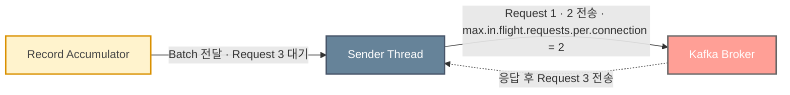

위 예시에서 설정값이 `2`이므로 Sender는 하나의 Broker 연결에서 Request 1과 Request 2의 응답을 기다리는 동안 Request 3을 추가로 전송하지 않는다. 둘 중 하나의 응답을 받아 in-flight 요청 수가 줄어야 다음 Request를 전송할 수 있다.

## Producer 메시지 전송 순서와 Broker 저장 순서

Producer가 `send()`를 호출한 순서와 Broker에 기록되는 순서는 항상 완전히 같다고 단정할 수 없다. 서로 다른 Partition은 독립적으로 처리되고, 비동기 전송·여러 in-flight 요청·재시도가 함께 작동하기 때문이다.

여러 요청의 전송을 허용한 상태에서 재시도가 발생하면 같은 Partition의 기록 순서가 달라질 수 있다.

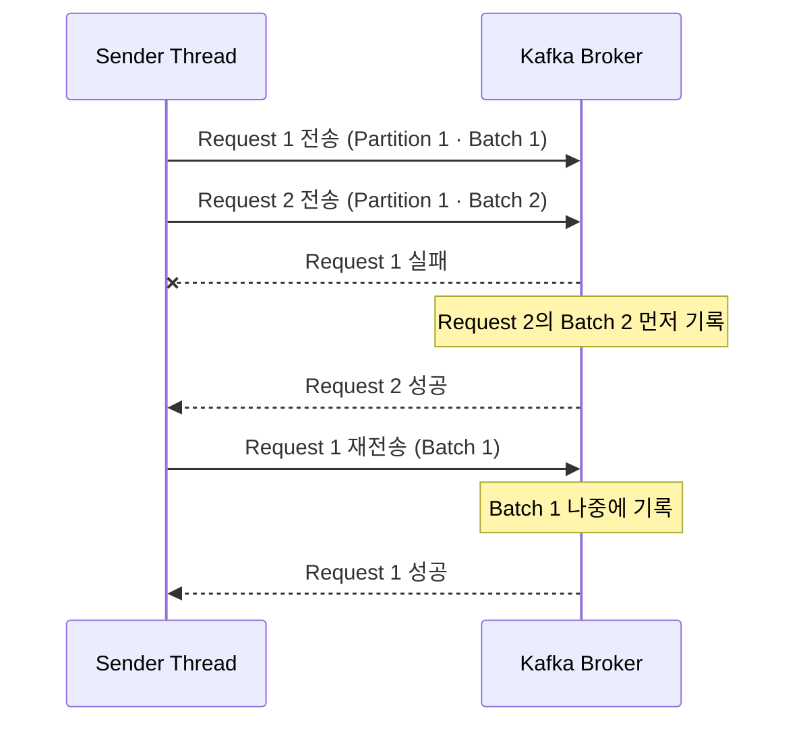

동시에 여러 요청을 보내면 처리량을 높일 수 있다. 다만 재시도가 발생하는 환경에서는 먼저 보낸 요청이 다시 전송되는 동안 뒤 요청이 먼저 기록되어, 같은 Partition의 순서가 기대와 달라질 수 있다. 멱등성 Producer를 사용하면 Kafka가 이 문제를 제어할 수 있으며, 관련 설정은 함께 검토해야 한다.

다만 같은 Partition 안에서는 Broker가 기록한 Offset 순서가 Consumer가 읽는 순서다. 순서가 필요한 이벤트는 같은 Key를 사용해 같은 Partition으로 보내고, 재시도와 멱등성 설정까지 포함해 전송 정책을 설계해야 한다.

## 메시지 전송 보장 방식

Kafka Producer의 전송 보장은 ACK 확인 여부, 재시도, 멱등성 설정에 따라 달라진다.

### 최대 한 번 전송(At most once)

최대 한 번 전송은 메시지를 한 번만 보내고, 전송 결과가 불확실해도 재시도하지 않는 방식이다. `acks=0`이 대표적인 예다. Producer는 Broker의 ACK를 기다리지 않으므로 빠르게 다음 메시지를 보낼 수 있지만, 전송 실패를 확인하거나 복구할 수 없다.

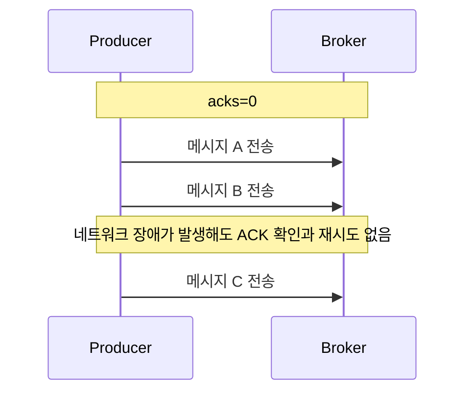

따라서 재시도로 인한 중복은 발생하지 않지만, 실패한 메시지가 한 번도 기록되지 않을 수 있다.

### 최소 한 번 전송(At least once)

최소 한 번 전송은 Producer가 Broker의 ACK를 확인하고, ACK를 받지 못하면 메시지를 재전송하는 방식이다. 일반적으로 `acks=1` 또는 `acks=all`과 재시도를 함께 사용한다.

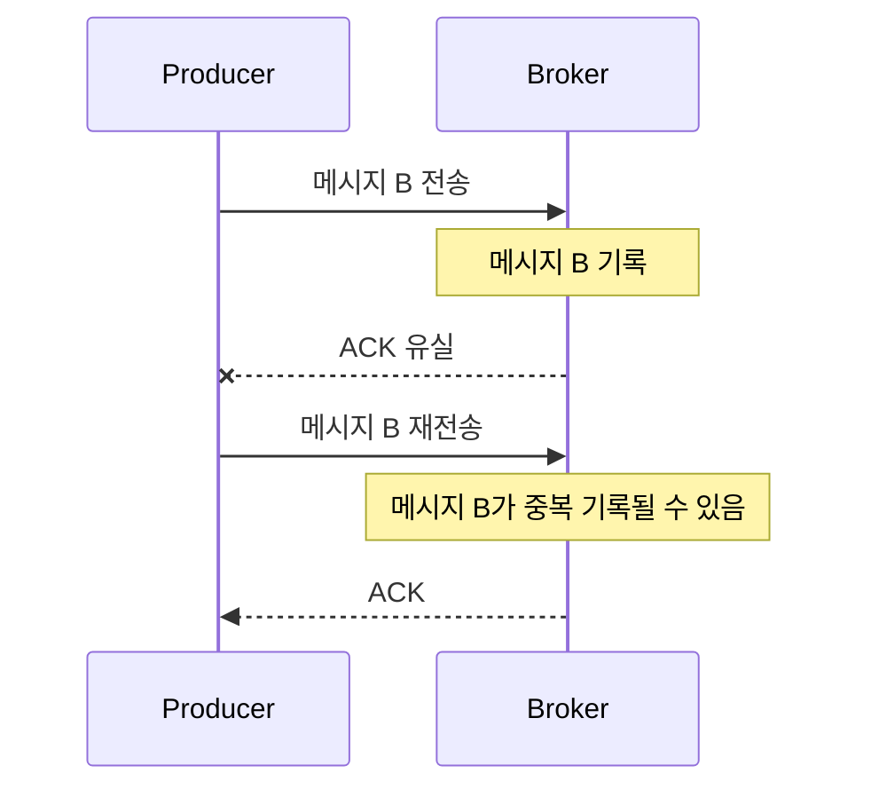

Broker가 메시지를 기록했지만 ACK만 유실된 경우에도 Producer는 실패로 판단하고 재전송한다. 따라서 메시지 유실 가능성은 줄지만, 같은 메시지가 중복 기록될 수 있다. 여러 in-flight 요청을 허용한 경우에는 ACK를 하나씩 받은 뒤에만 다음 요청을 보내는 것이 아니라, 설정된 범위 안에서 여러 요청을 연속으로 보낼 수 있다.

### 멱등성 Producer와 중복 없는 재시도

멱등성 Producer는 재시도로 같은 메시지가 다시 전송되더라도 Broker가 중복을 식별해 로그에 한 번만 기록하도록 한다. Producer가 보내는 Batch에는 Producer ID(PID)와 Partition별 Sequence가 포함된다.

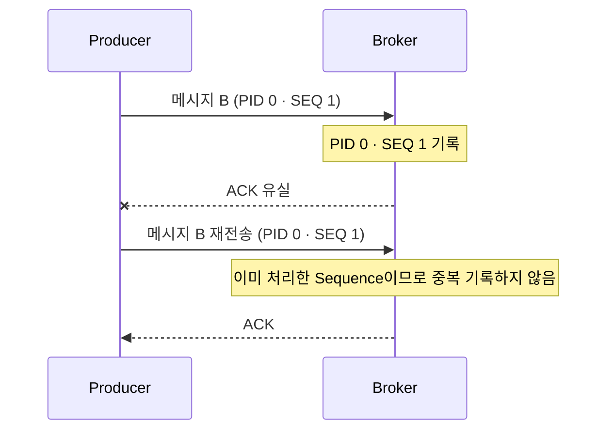

PID는 Producer 인스턴스를 식별하고, Sequence는 Topic-Partition별 Batch 순서를 나타낸다. Sequence는 개별 메시지의 전역 고유 번호가 아니다. Broker는 PID와 Partition별 마지막 Sequence를 추적하며, 재전송된 Sequence가 이미 처리된 값이면 로그에 다시 추가하지 않고 ACK만 반환한다.

Kafka 3.0부터 `enable.idempotence`의 기본값은 `true`다. 멱등성 Producer가 동작하려면 다음 설정 조건을 만족해야 한다.


| 설정                                      | 조건        |
| --------------------------------------- | --------- |
| `enable.idempotence`                    | `true`    |
| `acks`                                  | `all`     |
| `retries`                               | `0`보다 큰 값 |
| `max.in.flight.requests.per.connection` | `5` 이하    |


`enable.idempotence=true`를 명시한 상태에서 충돌하는 값을 설정하면 Producer 생성 시 `ConfigException`이 발생한다. 명시하지 않은 상태에서 `acks=1`처럼 충돌하는 값을 설정하면 Producer는 동작하더라도 멱등성이 비활성화될 수 있다.

### 멱등성 Producer의 범위

멱등성 Producer가 제거하는 중복은 **하나의 Producer 세션에서 Broker로 재시도하는 과정에서 발생한 중복**이다. 애플리케이션이 `send()`를 두 번 호출한 경우에는 서로 다른 전송으로 처리되므로 중복 제거 대상이 아니다. Producer가 재기동되어 PID가 바뀐 뒤 이전 메시지를 다시 보내는 경우도 같은 메시지로 판단할 수 없다.

또한 `Consumer → Process → Producer` 흐름에서 출력 메시지는 전송했지만 Consumer Offset을 저장하지 못하면, Consumer가 이전 Offset부터 다시 처리하면서 같은 출력 메시지를 보낼 수 있다. 이 문제는 멱등성 Producer만으로 해결할 수 없으며 Transaction 기반 처리가 필요하다. Transaction과 End-to-End Exactly Once는 이 글에서 다루지 않는다.

참고로 외부 DB 변경과 Kafka 메시지 발행을 함께 처리할 때는 **Transactional Outbox Pattern**을 사용할 수 있다. 비즈니스 데이터와 발행할 이벤트를 같은 DB Transaction에 저장하고, 별도 Publisher가 Outbox의 이벤트를 Kafka로 전달하는 방식이다. 자세한 내용은 이 글에서 다루지 않는다.

## Kafka 4.x Partitioner

### 기본 Partitioner의 변화

`ProducerRecord`에 Partition을 직접 지정하지 않으면 Producer는 직렬화된 Key와 Value를 바탕으로 Partition을 선택한다.

Kafka 3.x까지 사용되던 `DefaultPartitioner`는 Key가 있는 메시지의 직렬화된 Key를 해싱해 Partition을 선택했다. 따라서 같은 Topic에서 같은 Key는 Partition 수가 바뀌지 않는 한 일반적으로 같은 Partition으로 전송된다.

Kafka 4.0부터 `DefaultPartitioner`는 제거되었다. `partitioner.class`를 설정하지 않으면 Kafka 내부 기본 로직이 동작하며, Key가 있는 경우 내부의 `BuiltInPartitioner.partitionForKey()`가 직렬화된 Key를 해싱한다.

Key가 없는 경우에는 메시지마다 Partition을 바꾸지 않고, 선택한 Partition의 Batch에 메시지를 모은 뒤 다음 Partition을 선택하는 Sticky 방식을 사용한다. Adaptive Sticky는 Broker별 전송 대기량과 처리 상태를 참고해 상대적으로 원활한 Broker의 Partition을 더 선택할 수 있도록 조정한다. 이를 통해 작은 Batch가 여러 Partition에 흩어지는 것을 줄인다.

`BuiltInPartitioner`는 내부 구현이므로 애플리케이션에서 직접 지정하면 안 된다.

### Partitioner 인터페이스

Kafka 4.3.1의 공개 `Partitioner` 인터페이스는 다음과 같다. 이전 버전 예제에서 볼 수 있는 `onNewBatch()`는 현재 인터페이스에 없다. `configure()`는 상위 `Configurable` 인터페이스에서 상속된다.

```java
public interface Partitioner extends Configurable, Closeable {

    int partition(
            String topic,
            Object key,
            byte[] keyBytes,
            Object value,
            byte[] valueBytes,
            Cluster cluster
    );

    @Override
    void close();
}
```

### Producer 내부 처리 흐름

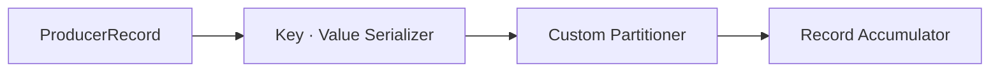

### Custom Partitioner 구현

기본 규칙이 아닌 자체 Partition 선택 규칙이 필요하면 공개 API인 `Partitioner` 인터페이스를 구현한다. 핵심은 `partition()` 메서드에서 Topic, Key, 직렬화된 Key·Value, Cluster 정보를 이용해 전송할 Partition 번호를 반환하는 것이다.

```java
public class CustomPartitioner implements Partitioner {

    @Override
    public int partition(
            String topic,
            Object key,
            byte[] keyBytes,
            Object value,
            byte[] valueBytes,
            Cluster cluster
    ) {
        if (keyBytes == null) {
            throw new InvalidRecordException("key must not be null");
        }

        int partitionCount = cluster.partitionCountForTopic(topic);
        return Utils.toPositive(Utils.murmur2(keyBytes)) % partitionCount;
    }

    @Override
    public void configure(Map<String, ?> configs) {
    }

    @Override
    public void close() {
    }
}
```

작성한 구현체는 Producer 설정의 `partitioner.class`에 등록한다.

```java
props.setProperty(
        ProducerConfig.PARTITIONER_CLASS_CONFIG,
        CustomPartitioner.class.getName()
);
```

같은 Key를 항상 같은 Partition으로 보내거나 특정 Key만 별도 Partition 집합으로 분리하는 등 요구사항에 맞게 `partition()` 로직을 작성할 수 있다. 다만 특정 Partition만 계속 반환하면 해당 Partition에 부하가 집중될 수 있으므로 분산 상태를 함께 확인해야 한다.

## 정리

- `acks`는 Producer가 메시지 전송을 성공으로 판단하기 위해 기다리는 Broker 응답 범위를 결정한다.
- `acks=all`의 성공 조건은 `min.insync.replicas`와 함께 결정된다.
- 호출 Thread는 레코드를 `Record Accumulator`에 저장하고, 별도의 `Sender` Thread가 Batch를 Broker로 전송한다.
- 재시도와 여러 in-flight 요청을 함께 사용하면 같은 Partition의 기록 순서와 중복 가능성을 고려해야 한다.
- 멱등성 Producer는 PID와 Partition별 Sequence를 이용해 재시도로 발생하는 중복 기록을 방지한다.
- Consumer Offset이나 외부 DB까지 포함한 처리는 멱등성 Producer의 범위를 벗어나며, Transaction 또는 Transactional Outbox Pattern 같은 별도 처리가 필요하다.
- Kafka 4.x에서는 `DefaultPartitioner`가 제거되었으며, 자체 규칙이 필요할 때 공개 `Partitioner` 인터페이스를 구현한다.
