## 개요

Kafka Producer는 메시지를 바로 Broker로 보내지 않는다.

메시지를 `byte[]`로 직렬화한 후 Partitioner를 통해 전송할 Partition을 결정한다. 이후 Partition별 Batch에 메시지를 모았다가 Kafka Broker로 한 번에 전송한다.

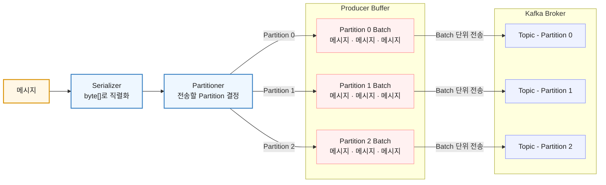

## Serialization과 Deserialization

Producer는 메시지를 `byte[]`로 직렬화한 후 전송한다. Broker에도 메시지는 `byte[]` 형태로 저장된다.

메시지를 바이트 배열로 변환하면 네트워크 대역폭과 압축에서 이점이 있다.

Consumer는 Broker에서 읽은 `byte[]`를 다시 사용할 수 있는 데이터 형태로 변환하기 위해 Deserialization을 수행한다.

기본적으로 자바에서는 `StringSerializer`, `StringDeserializer`를 통해 직렬화와 역직렬화를 수행할 수 있다.

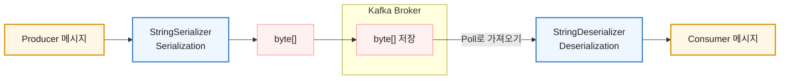

## Partitioner

Producer가 메시지를 전송할 때 Partitioner는 해당 메시지를 Topic의 어떤 Partition으로 보낼지 결정한다.

메시지에 Key가 있는지에 따라 Partition을 결정하는 방식이 달라진다.

### 메시지가 Key를 가지는 경우

특정 Key 값을 가진 메시지는 Key를 해싱한 결과에 따라 특정 Partition으로 고정되어 전송된다.

따라서 같은 Key를 가진 메시지는 같은 Partition에 저장된다.

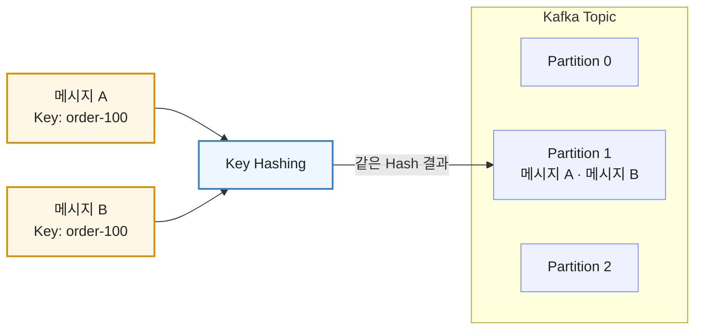

### Key가 없는 메시지의 Partition 분배 전략

Key가 없는 메시지는 별도의 Partition 분배 전략에 따라 전송할 Partition이 결정된다.

#### Round Robin Partitioning

Round Robin은 Kafka 2.4 이전에 사용된 기본 분배 전략이다.

메시지를 여러 Partition에 순서대로 보내 각 Partition에 균일하게 분배한다. 각 Partition으로 나뉜 메시지는 해당 Partition의 Batch에 쌓인다.

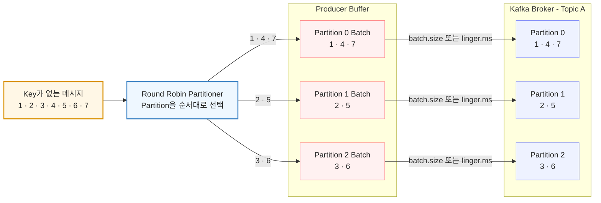

Batch는 설정된 Batch 크기가 다 차거나, 설정된 대기 시간이 지나면 Kafka Broker로 전송된다.

Round Robin 방식은 메시지가 여러 Partition의 Batch로 나뉘어 쌓인다. 각 Batch를 빠르게 채우지 못하면 전송이 늦어질 수 있고, 설정된 시간 안에 Batch 크기만큼 메시지를 모으지 못하면 Batch 전송 효율이 떨어진다.

#### Sticky Partitioning

Sticky Partitioning은 Kafka 2.4 이후의 기본 분배 전략이다.

일정 기간 하나의 Partition을 선택하여 Key가 없는 메시지를 같은 Batch에 모은다. 해당 Batch의 전송이 끝나면 다음 Partition을 선택한다.

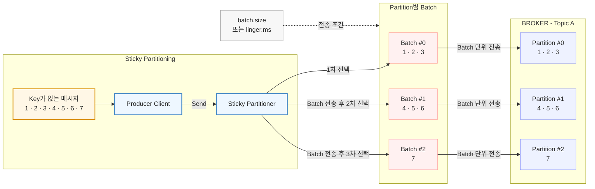

메시지를 하나의 Partition Batch에 집중해서 모으기 때문에 Round Robin보다 Batch를 빠르게 채울 수 있다.

## 메시지 순서 보장

하나의 Topic이 여러 Partition을 가지면 Topic 전체의 메시지 순서는 보장되지 않는다. 여러 Partition이 독립적으로 메시지를 저장하고 처리하기 때문이다.

메시지 순서는 하나의 Partition 안에서만 보장된다.

따라서 Topic 전체에서 메시지 순서를 보장해야 한다면 Partition을 하나만 사용해야 한다. 다만 하나의 Partition만 사용하면 병렬 처리가 제한되어 처리 속도가 낮아질 수 있다.

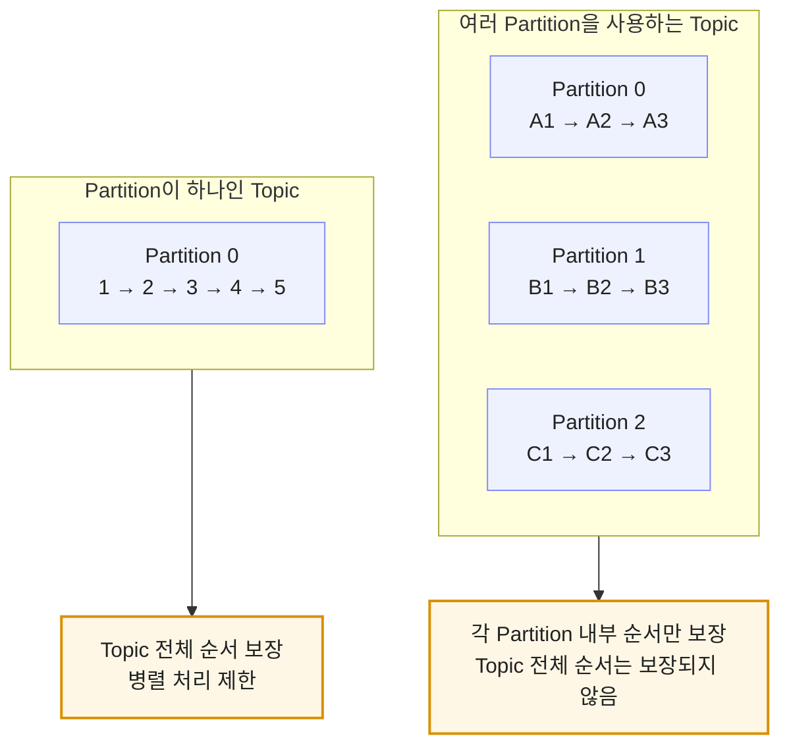

## Consumer와 Consumer Group

Consumer Group은 하나 이상의 Consumer가 모여 Topic의 메시지를 나눠 읽는 하나의 팀이다.

여러 Consumer가 같은 `group.id`를 사용하면 같은 Consumer Group에 속한다. Consumer는 자신이 속할 Consumer Group을 `group.id`로 구분한다.

`group.id`는 사용자가 설정하지만, 일반적인 동적 Consumer Group에서 각 Consumer를 구분하는 Member ID는 사용자가 직접 만들지 않는다. Broker의 Group Coordinator가 Consumer의 그룹 참여 요청을 받으면 Member ID를 생성해 할당한다.

### Consumer Group 조회 결과 확인

Consumer Group의 상태를 조회하면 Group이 읽고 있는 Topic과 Partition별 Offset, Lag, 현재 연결된 Consumer 정보를 확인할 수 있다.


| 항목               | 의미                                                       |
| ---------------- | -------------------------------------------------------- |
| `GROUP`          | Consumer Group 이름                                        |
| `TOPIC`          | Consumer Group이 읽는 Topic 이름                              |
| `PARTITION`      | Topic의 Partition 번호                                      |
| `CURRENT-OFFSET` | Consumer Group이 해당 Partition에서 다음에 읽을 위치                 |
| `LOG-END-OFFSET` | 해당 Partition에 저장된 메시지의 마지막 위치를 기준으로 한 다음 Offset          |
| `LAG`            | 아직 처리하지 못한 메시지 수. `LOG-END-OFFSET - CURRENT-OFFSET`으로 계산 |
| `CONSUMER-ID`    | 현재 Partition을 할당받은 Consumer의 Member ID                   |
| `HOST`           | Consumer가 실행 중인 Host 정보                                  |
| `CLIENT-ID`      | Consumer Client를 구분하기 위해 설정한 ID                          |


### Consumer가 없는 Group의 보관과 삭제

Consumer Group 안에 Consumer가 없어져도 Group이 즉시 삭제되지는 않는다. Group이 비어 있는 동안에도 기존에 저장한 Offset 정보는 Broker의 `offsets.retention.minutes` 설정에 따라 일정 기간 보관된다. 설정 기간 이후에 삭제된다.

Consumer Group을 보관 기간과 관계없이 바로 삭제하려면 별도의 Group 삭제 명령을 실행해야 한다. 이때 Group 안에 실행 중인 Consumer가 있으면 삭제할 수 없으므로, 모든 Consumer를 먼저 종료하여 Group을 비운 후 삭제해야 한다.


같은 Consumer Group 안에서는 하나의 Partition이 동시에 하나의 Consumer에만 할당된다. 반대로 하나의 Consumer는 여러 Partition을 할당받을 수 있다.

### Consumer가 한 개인 경우

Partition이 4개이고 Consumer가 1개라면 하나의 Consumer가 4개의 Partition을 모두 처리한다.

이 구조가 항상 병목을 발생시키는 것은 아니지만, Consumer Group 내부의 처리 병렬성은 Consumer 1개로 제한된다. 처리량이 부족하다면 Partition 수에 맞춰 Consumer를 늘려 병렬 처리 성능을 높일 수 있다.

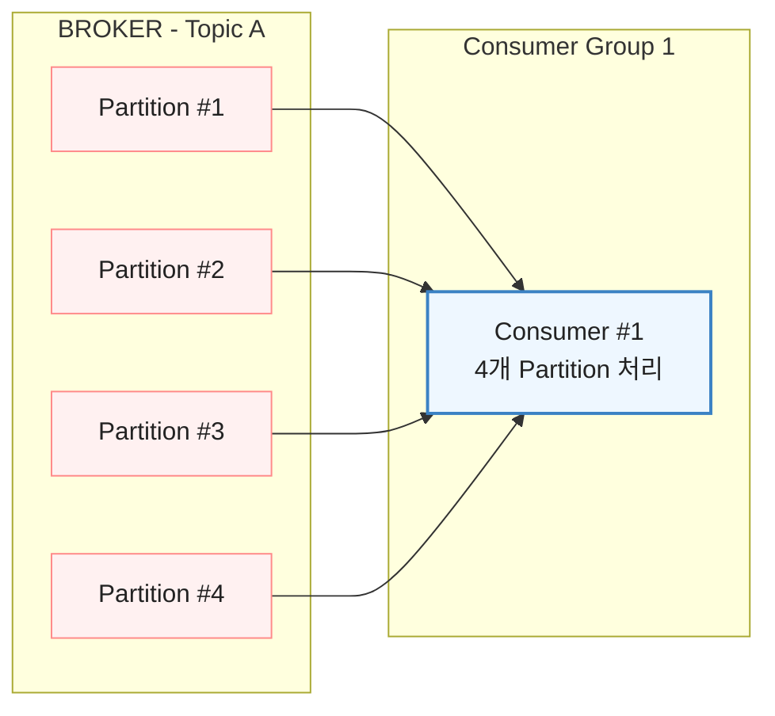

### Rebalancing이란?

**Rebalancing은 Consumer Group 안에서 Partition을 어떤 Consumer가 읽을지 다시 정하는 과정이다.**

새로운 Consumer가 Consumer Group에 참여하거나 기존 Consumer가 빠지면 Consumer 수가 달라진다. 이때 기존 Partition 할당을 조정하고, 현재 Consumer 수에 맞춰 Partition을 다시 나눠준다.

따라서 Consumer가 1개에서 2개로 늘어날 때와 2개에서 4개로 늘어날 때 모두 Rebalancing이 발생한다. 

Consumer가 1개에서 2개로 늘어나면 기존 Consumer가 처리하던 Partition 일부가 새 Consumer에게 다시 할당된다.

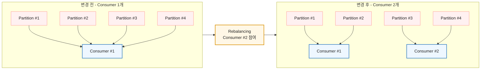

Consumer가 2개에서 4개로 늘어날 때도 Rebalancing이 발생한다. Partition이 4개라면 각 Consumer가 하나의 Partition을 맡아 최대 4개까지 병렬로 처리할 수 있다.

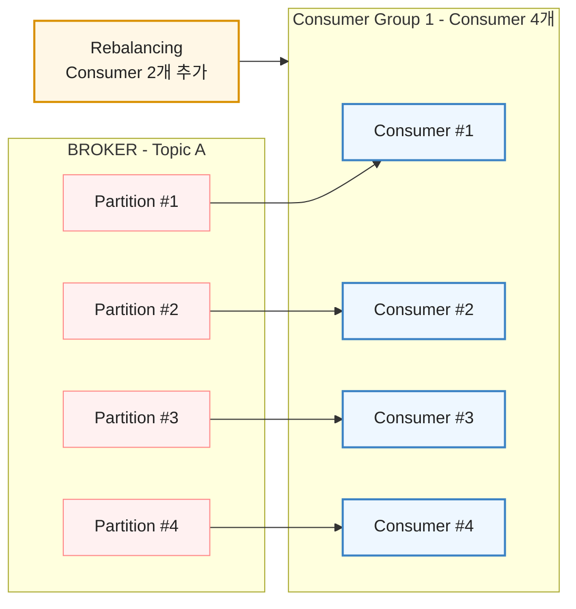

### Consumer가 Partition보다 많은 경우

같은 Consumer Group에서는 하나의 Partition을 동시에 두 Consumer에게 할당하지 않는다. 따라서 Partition이 4개인데 Consumer가 5개라면 4개만 Partition을 할당받고 나머지 Consumer 1개는 유휴 상태가 된다.

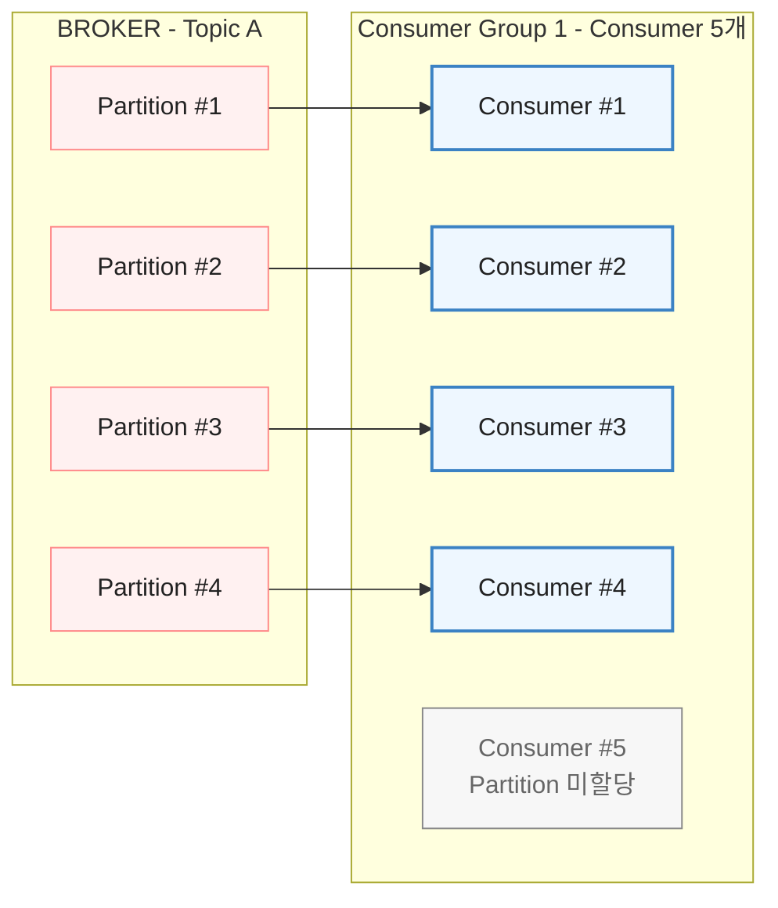

### Consumer Group은 서로 독립적이다

Consumer Group끼리는 서로 독립적으로 Partition을 할당받고 Offset을 관리한다.

따라서 같은 Partition은 Consumer Group 1의 Consumer 한 개와 Consumer Group 2의 Consumer 한 개에 각각 할당될 수 있다. 각 Consumer Group은 다른 Consumer Group의 처리 여부와 관계없이 같은 메시지를 독립적으로 읽는다.

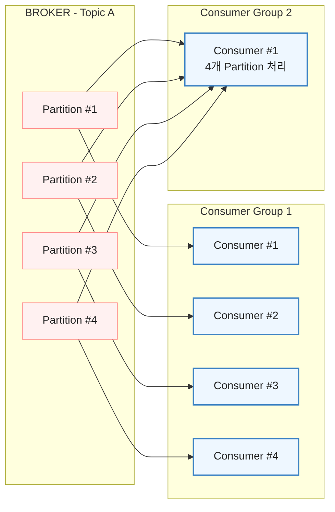

## Kafka Config

Kafka Config는 설정이 적용되는 위치에 따라 크게 두 가지로 구분할 수 있다.

### Broker, Topic 레벨 Config

Kafka 서버 내부에서 Broker와 Topic의 동작을 설정한다.

- **Static Config**: `server.properties`에 작성하는 설정이다. 값을 변경한 뒤 적용하려면 Broker를 재시작해야 한다.
- **Dynamic Config**: Broker를 재시작하지 않고 동적으로 변경할 수 있는 설정이다. `kafka-configs` 명령어를 통해 변경한다.

Topic별 설정도 `kafka-configs.sh`를 사용해 동적으로 변경할 수 있다.

### Producer, Consumer 레벨 Config

Kafka 서버가 아니라 Kafka Client에서 설정한다.

- Producer Config: 메시지 전송 방식과 관련된 설정
- Consumer Config: 메시지 소비 방식과 관련된 설정

즉, Broker와 Topic 레벨 Config는 Kafka 서버 측 설정이고, Producer와 Consumer 레벨 Config는 Kafka Client 측 설정이다.

## Kafka Broker에 저장된 메시지 확인

Broker 내부에 저장된 메시지는 `kafka-dump-log`를 사용해 확인할 수 있다.

kafka-logs에 모든 로그가 저장되고 해당 파티션에서 `kafka-dump-log` 를 사용해서 해당 파티션의 메시지들을 호가인할 수 있다.

출력에서 `key`는 메시지의 Key, `payload`는 메시지의 Value를 의미한다.

## 정리

```text
Serialization: Producer 메시지를 byte[]로 변환하는 과정
Partitioner: 메시지를 전송할 Partition을 결정하는 구성 요소
Key가 있는 메시지: 같은 Key를 가진 메시지는 같은 Partition으로 전송
Sticky Partitioning: Key가 없는 메시지를 하나의 Partition Batch에 모아 전송
메시지 순서: 하나의 Partition 안에서만 보장
Consumer Group: 여러 Consumer가 Partition을 나눠 읽는 하나의 팀
Rebalancing: Consumer 수의 변화에 맞춰 Partition을 다시 할당하는 과정
Broker, Topic Config: Kafka 서버 내부에서 설정
Producer, Consumer Config: Kafka Client에서 설정
kafka-dump-log: 메시지를 확인하는 명령어
```

