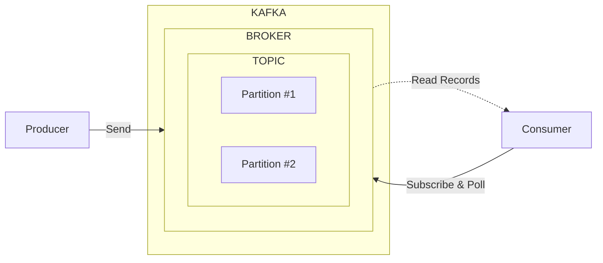

---
title: "Kafka는 메시지 큐가 아니라 이벤트 로그다"
date: "2026-07-02"
description: "Kafka를 Topic, Partition, Producer, Consumer 관점에서 이해하고 이벤트 기반 시스템에서 어떤 역할을 하는지 정리합니다."
keyword: "Kafka"
tags:
    - Backend
    - Kafka
    - Event Driven
thumbnail: /assets/img/thumbnail/backend-notes.png
bookmark: true
---

## 브로커

## 토픽
파티션으로 구성된 일련의 로그 파일 여기서 로그파일은 

## 파티션

## 
