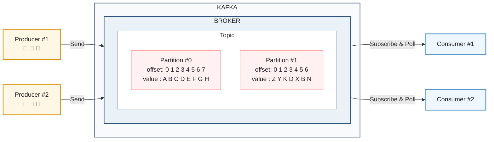
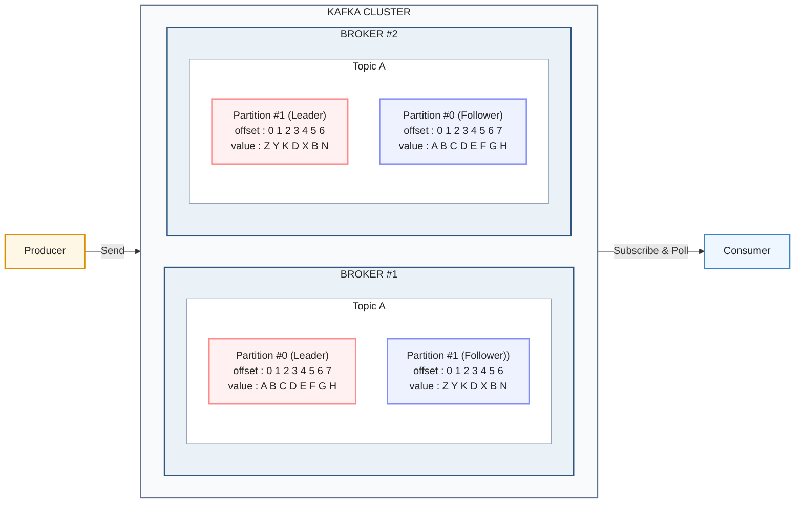

---
title: "Kafka의 Topic, Partition, Producer, Consumer 이해하기"
date: "2026-07-02"
description: "Kafka의 기본 구조를 Topic, Partition, Producer, Consumer, Offset 중심으로 정리합니다."
keyword: "KKafka 기본 구조"
tags:
    - Backend
    - Kafka
    - Message Queue
    - Topic
    - Partition
    - Producer
    - Consumer
    - Offset
thumbnail: /assets/img/thumbnail/backend-notes.png
bookmark: true
---



## Kafka Cluster

Kafka Cluster는 여러 Kafka Broker가 하나의 Kafka 시스템처럼 동작하도록 묶인 구조다.

운영 환경에서는 보통 Broker를 여러 대 두고, 데이터를 여러 Broker에 분산 저장한다. 이렇게 하면 저장 공간과 처리량을 나눌 수 있고, 복제를 통해 장애 상황에서도 가용성을 높일 수 있다.

## Broker

Broker는 Kafka 서버 한 대를 의미한다.

Producer가 보낸 메시지를 저장하고, Consumer가 메시지를 읽을 수 있도록 제공한다. 여러 Broker가 모이면 하나의 Kafka Cluster를 구성한다.

## Topic

Topic은 Kafka에서 메시지를 구분하는 논리적인 이름이다.

파티션으로 구성된 일련의 로그 파일이다.

예를 들어 주문 생성 이벤트는 order-created Topic에 저장하고, 결제 완료 이벤트는 payment-completed Topic에 저장할 수 있다.

Topic은 하나 이상의 Partition으로 구성된다. 메시지 자체는 Topic이라는 추상적인 공간에 바로 저장되는 것이 아니라, Topic 내부의 Partition에 저장된다.

```text
Topic: order-created
 ├─ Partition 0
 ├─ Partition 1
 └─ Partition 2
 ```

여기서 로그파일이란 메시지를 들어 온 순서대로 저장해둔 파일, 즉 메시지를 순차적으로 계속 덧붙여 저장하는 append-only 데이터 파일


## Partition

Partition은 Topic을 나눈 실제 저장 단위다.

Partition 안의 메시지는 들어온 순서대로 append 된다. 이미 기록된 메시지를 수정하는 방식이 아니라, 로그 파일 뒤에 계속 덧붙이는 append-only 구조로 저장된다.

각 메시지는 Partition 안에서 고유한 offset을 가진다.

```text
Partition #0
offset: 0  1  2  3  4
value : A  B  C  D  E
```

파티티션은 독립적으로 존재하고 정렬 되어있다. 또한 변경이 불가능(immutable)하다. 

## 병렬 분산 처리

Topic에 Partition이 여러 개 있으면 Kafka는 메시지를 여러 Partition에 나누어 저장할 수 있다.

Consumer도 Partition 단위로 메시지를 읽을 수 있기 때문에, Partition이 여러 개면 병렬 처리가 가능해진다.




### Replication

Broker 한 대에만 데이터가 저장되어 있다면, 해당 Broker에 장애가 발생했을 때 데이터를 읽을 수 없게 된다.

이를 막기 위해 Kafka는 Partition을 여러 Broker에 복제할 수 있다.

```text
replication-factor = 2

Partition 0
 ├─ Leader Replica
 └─ Follower Replica
 ```

replication-factor = 2는 같은 Partition의 복제본이 총 2개 있다는 의미다. 

보통 하나는 Leader, 나머지는 Follower가 된다.

Producer와 Consumer는 Leader Partition을 기준으로 읽고 쓴다. Follower는 Leader의 데이터를 복제하다가, Leader가 있는 Broker에 장애가 발생하면 새로운 Leader가 될 수 있다.

복제를 사용하면 가용성을 높일 수 있지만, 같은 데이터를 여러 곳에 저장하므로 더 많은 스토리지가 필요하다.

## Producer

Producer는 Kafka Topic에 메시지를 발행하는 주체다.

예를 들어 주문 서비스는 주문이 생성되었을 때 order-created Topic으로 메시지를 보낼 수 있다.

```text
Order Service
  -> Producer
  -> order-created Topic
```

Producer가 보내는 메시지는 ProducerRecord 형태로 볼 수 있다.

<div align="center">
<svg width="260" height="360" viewBox="0 0 260 360" xmlns="http://www.w3.org/2000/svg">
  <rect x="30" y="20" width="200" height="320" fill="#f7f7f7" stroke="#666" stroke-width="2"/>
  <rect x="50" y="60" width="160" height="48" fill="#425865"/>
  <rect x="50" y="108" width="160" height="48" fill="#c7d2d5"/>
  <rect x="50" y="156" width="160" height="48" fill="#c7d2d5"/>
  <rect x="50" y="204" width="160" height="48" fill="#425865"/>
  <rect x="50" y="252" width="160" height="48" fill="#c7d2d5"/>
  <text x="130" y="45" text-anchor="middle" font-family="Arial, sans-serif" font-size="18" font-weight="700" fill="#555">ProducerRecord</text>
  <text x="130" y="91" text-anchor="middle" font-family="Arial, sans-serif" font-size="18" font-weight="700" fill="#fff">Topic</text>
  <text x="130" y="139" text-anchor="middle" font-family="Arial, sans-serif" font-size="18" font-weight="700" fill="#555">Partition</text>
  <text x="130" y="187" text-anchor="middle" font-family="Arial, sans-serif" font-size="18" font-weight="700" fill="#555">Key</text>
  <text x="130" y="235" text-anchor="middle" font-family="Arial, sans-serif" font-size="18" font-weight="700" fill="#fff">Value</text>
  <text x="130" y="283" text-anchor="middle" font-family="Arial, sans-serif" font-size="18" font-weight="700" fill="#555">Header</text>
  <line x1="50" y1="108" x2="210" y2="108" stroke="#ffffff" stroke-width="2"/>
  <line x1="50" y1="156" x2="210" y2="156" stroke="#ffffff" stroke-width="2"/>
  <line x1="50" y1="204" x2="210" y2="204" stroke="#ffffff" stroke-width="2"/>
  <line x1="50" y1="252" x2="210" y2="252" stroke="#ffffff" stroke-width="2"/>
</svg>
</div>

| 구성 요소 | 필수 여부 | 설명 |
| --- | --- | --- |
| Topic | 필수 | 메시지를 보낼 Topic |
| Partition | 선택 | 메시지를 보낼 Partition |
| Key | 선택 | Partition 선택에 사용될 수 있는 값 |
| Value | 필수 | 실제 전송할 메시지 본문 |
| Header | 선택 | 메시지에 붙이는 추가 메타데이터. 예: 타임스태프, eventType 등 |

## Consumer

Consumer는 Kafka Topic의 Partition에서 메시지를 읽는 주체다.

Kafka는 Consumer에게 메시지를 강제로 밀어 넣지 않는다. 

Consumer가 Broker에 poll 요청을 보내고, 읽을 수 있는 메시지를 가져오는 방식이다.

## Offset

Offset은 Partition 안에서 메시지의 위치를 나타내는 번호다.

```text
Partition #0
offset: 0  1  2  3  4
value : A  B  C  D  E
```

Consumer는 Topic에 처음 접속하여 메시지를 가져올 때 가장 오래된 처음 Offset부터 가지고 올 것인지, 가장 마지막 Offset 부터 가져 올 것인지를 설정할 수 있다.

```text
latest: 새로 들어오는 메시지부터 읽는다.
earliest: 가장 처음 offset부터 읽는다.
```

`auto.offset.reset`의 기본값은 보통 `latest`다.

## 정리

```text
Broker: Kafka 서버 한 대
Cluster: 여러 Broker를 묶은 Kafka 시스템
Topic: 메시지를 구분하는 논리적인 이름
Partition: Topic 내부의 실제 저장 단위
Offset: Partition 안에서 메시지의 위치
Producer: 메시지를 발행하는 주체
Consumer: 메시지를 읽는 주체
Replication: Partition을 여러 Broker에 복제하는 방식
```